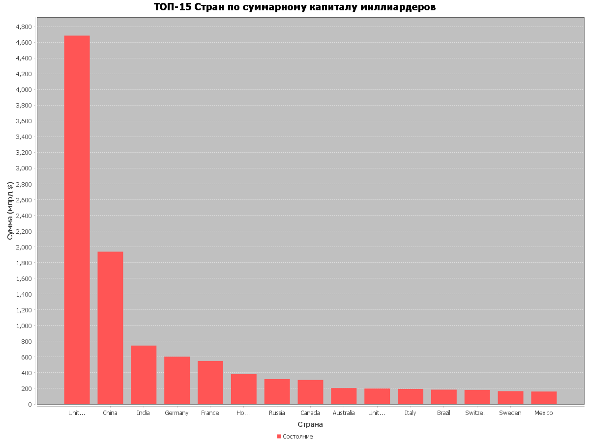

# java-project
Семестровый проект «Forbes»

## Вывод
```shell
>>> Запуск анализатора данных Forbes...
Успешно прочитано 2600 записей из CSV
Данные успешно мигрированы в SQLite.

--- Результаты анализа ---

=== Общий капитал по странам (Топ) ===
United States       : $4685.10 млрд
China               : $1938.45 млрд
India               : $744.80 млрд
Germany             : $604.00 млрд
France              : $550.00 млрд
(70 линий ещё...)

=== Самый молодой миллиардер Франции (>$10 млрд) ===
Имя:       Emmanuel Besnier
Возраст:   51 лет
Состояние: $23.50 млрд
Источник:  cheese

=== Богатейший представитель энергетики США ===
Имя:       Harold Hamm & family
Компания:  oil & gas
Состояние: $17.20 млрд

График успешно сгенерирован: .\wealth_statistics.png
```

<div align="center">
  
</div>

## Разработка
### Билд
```shell
./gradlew clean build --no-daemon
```

#### Запуск
```shell
./gradlew run
```
